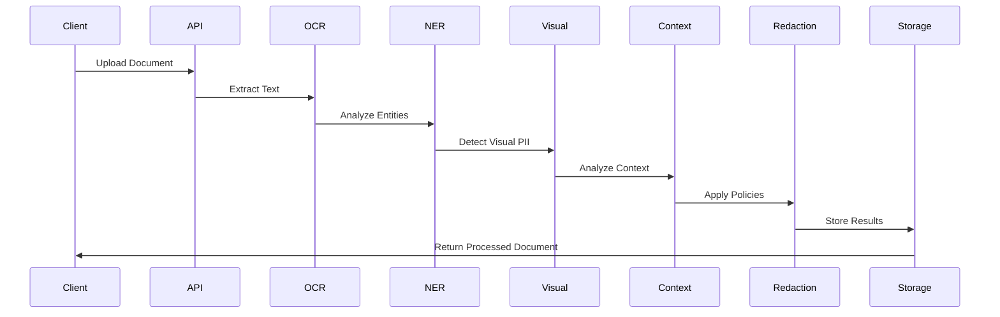
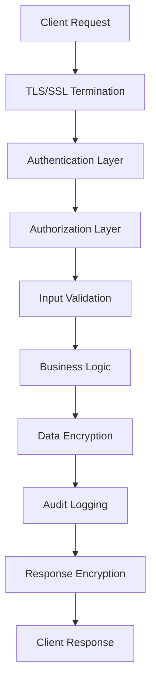
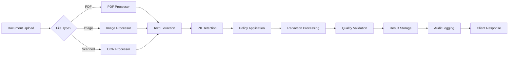
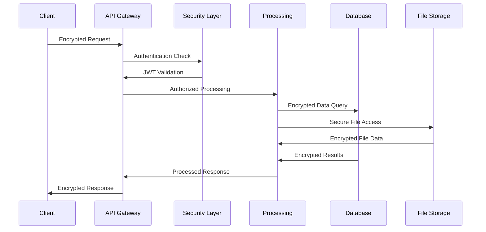
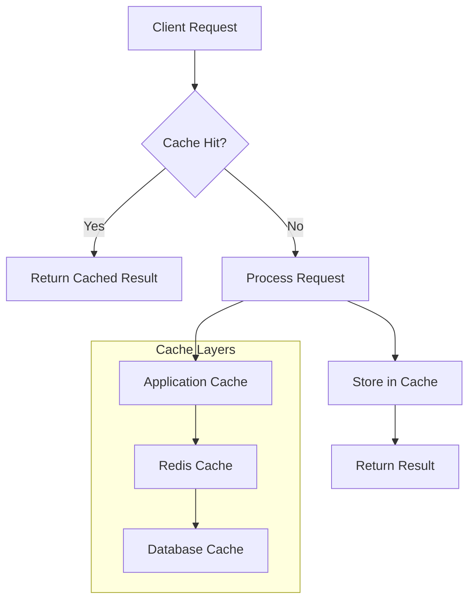
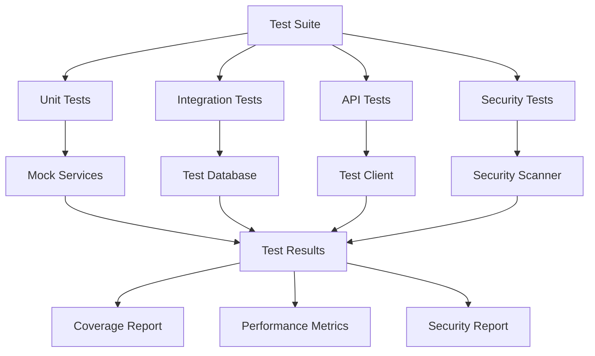

# System Architecture - Local AI-Powered PII De-identification System

## 🏗️ Overview

This document provides a comprehensive overview of the Local AI-Powered PII De-identification System architecture, designed for enterprise-grade privacy protection with complete local control and compliance across multiple regulatory frameworks.

## 🎯 Design Principles

### Core Principles
- **Privacy by Design**: All processing occurs locally with zero cloud dependencies
- **Compliance First**: Built-in support for GDPR, HIPAA, PCI-DSS, and other regulations
- **Scalability**: Horizontal and vertical scaling capabilities
- **Modularity**: Loosely coupled components for easy maintenance and extension
- **Security**: End-to-end encryption and zero-trust architecture
- **Auditability**: Complete audit trails for all operations
- **Performance**: Sub-second response times for real-time processing

### Technology Stack
- **Runtime**: Python 3.9+ with asyncio for concurrent processing
- **API Framework**: FastAPI with automatic OpenAPI documentation
- **AI/ML**: Local inference with spaCy, transformers, and custom models
- **Database**: SQLite (development) / PostgreSQL (production) with encryption
- **Cache**: Redis for session management and performance optimization
- **Queue**: Celery with Redis for background processing
- **Orchestration**: Apache Airflow for complex workflows
- **Containerization**: Docker and Docker Compose

## 🏛️ System Architecture

```mermaid
graph TB
    subgraph "Client Layer"
        WEB[Web Interface]
        API[REST API Clients]
        CLI[CLI Tools]
    end
    
    subgraph "API Gateway Layer"
        GW[FastAPI Gateway]
        AUTH[Authentication]
        RATE[Rate Limiting]
        CORS[CORS Handler]
    end
    
    subgraph "Application Layer"
        subgraph "Core Services"
            PII[PII Detection Service]
            RED[Redaction Engine]
            POL[Policy Engine]
            SEC[Security Service]
        end
        
        subgraph "Processing Pipeline"
            OCR[OCR Service]
            NER[NER Models]
            VIS[Visual PII Detection]
            CTX[Context Analysis]
        end
        
        subgraph "Business Intelligence"
            DASH[Dashboard Engine]
            REP[Reporting Engine]
            TEMP[Template Manager]
            ANA[Analytics Engine]
        end
    end
    
    subgraph "Orchestration Layer"
        AIR[Apache Airflow]
        CEL[Celery Workers]
        SCH[Job Scheduler]
        MON[Component Monitor]
    end
    
    subgraph "Data Layer"
        DB[(Database)]
        CACHE[(Redis Cache)]
        FILES[(File Storage)]
        QUEUE[(Message Queue)]
    end
    
    subgraph "AI/ML Models"
        SPACY[spaCy Models]
        TRANS[Transformer Models]
        YOLO[YOLOv8 Visual]
        MISTRAL[Mistral 7B]
        TESSERACT[Tesseract OCR]
    end
    
    subgraph "External Integrations"
        WEBHOOK[Webhooks]
        API_INT[External APIs]
        EXPORT[Data Export]
    end

    WEB --> GW
    API --> GW
    CLI --> GW
    
    GW --> AUTH
    GW --> RATE
    GW --> CORS
    
    AUTH --> PII
    AUTH --> RED
    AUTH --> POL
    AUTH --> DASH
    
    PII --> OCR
    PII --> NER
    PII --> VIS
    RED --> SPACY
    RED --> TRANS
    
    AIR --> CEL
    CEL --> QUEUE
    MON --> DB
    
    PII --> DB
    RED --> FILES
    DASH --> CACHE
    
    REP --> WEBHOOK
    EXPORT --> API_INT
```



## 📊 Component Architecture

### 1. API Gateway Layer

**FastAPI Application (`src/main.py`)**
- Central entry point for all HTTP requests
- Automatic OpenAPI/Swagger documentation generation
- Request validation with Pydantic models
- Exception handling and error responses
- CORS configuration for web clients

**Authentication & Authorization (`src/core/security/`)**
- JWT token-based authentication
- API key support for programmatic access
- Role-based access control (RBAC)
- Session management with Redis
- Rate limiting and throttling

### 2. Core Services Layer

**PII Detection Service (`src/core/services/pii_detector.py`)**
- Orchestrates multiple detection models
- Confidence scoring and entity validation
- Context-aware detection logic
- Multi-language support (English, Hindi)
- Performance optimization with caching

**Redaction Engine (`src/core/services/redaction_engine.py`)**
- Policy-driven redaction strategies
- Pseudonymization with reversible encryption
- Visual redaction for images and PDFs
- Context preservation algorithms
- Audit trail generation

**Policy Engine (`src/core/services/policy_engine.py`)**
- Dynamic policy loading and validation
- Compliance rule enforcement
- Custom policy creation interface
- Policy versioning and rollback
- Integration with regulatory frameworks

### 3. AI/ML Processing Pipeline

**Document Processing Pipeline**


**Model Components:**

1. **OCR Service (`src/core/services/ocr_service.py`)**
   - Tesseract OCR for text extraction
   - PaddleOCR for enhanced accuracy
   - Image preprocessing and optimization
   - Multi-language OCR support
   - Quality assessment metrics

2. **NER Models (`src/core/models/ner_models.py`)**
   - spaCy pipeline with custom entities
   - Presidio integration for enhanced detection
   - Custom transformer models
   - Confidence scoring algorithms
   - Entity relationship analysis

3. **Visual PII Detection (`src/core/models/visual_models.py`)**
   - YOLOv8 for object detection
   - Custom-trained models for PII entities
   - Bounding box detection and classification
   - Integration with OCR results
   - Performance optimization for real-time processing

4. **Context Analysis (`src/core/services/context_analyzer.py`)**
   - Mistral 7B for semantic understanding
   - Document type classification
   - Relationship extraction
   - Risk assessment algorithms
   - False positive reduction

### 4. Business Intelligence Layer

**Dashboard Engine (`src/core/dashboard/`)**
- Real-time metrics and KPIs
- Interactive visualizations with D3.js
- Customizable widget system
- Role-based dashboard views
- WebSocket support for live updates

**Reporting Engine (`src/core/reporting/`)**
- Automated report generation
- 50+ predefined templates
- Custom report builder
- Multi-format exports (PDF, Excel, JSON)
- Scheduled reporting with email delivery

**Analytics Engine (`src/core/reporting/analytics.py`)**
- Statistical analysis of PII patterns
- Trend detection and forecasting
- Risk scoring algorithms
- Performance benchmarking
- Compliance gap analysis

### 5. Data Layer

**Database Architecture**
```sql
-- Core Tables
Users (user management and RBAC)
Documents (document metadata and processing status)
DetectionResults (PII detection results with confidence scores)
RedactionLogs (audit trail for all redaction operations)
Policies (compliance policies and rules)
ComplianceReports (regulatory compliance reports)
SystemLogs (comprehensive system audit logs)

-- Monitoring Tables
ComponentHealth (real-time component status)
PerformanceMetrics (system performance data)
SecurityEvents (security incident logs)
AlertRules (monitoring and alerting configuration)
```

**File Storage Strategy**
- Encrypted local file system storage
- Document versioning with diff tracking
- Secure temporary file handling
- Automatic cleanup policies
- Backup and recovery mechanisms

### 6. Security Architecture

**Multi-Layer Security Model**


**Security Components:**

1. **Encryption Layer (`src/core/security/encryption.py`)**
   - AES-256-GCM for data at rest
   - RSA-2048 for key exchange
   - Field-level database encryption
   - Secure key rotation
   - Hardware security module support

2. **Authentication System (`src/core/security/auth.py`)**
   - JWT tokens with refresh mechanism
   - API key management
   - Multi-factor authentication support
   - Session hijacking protection
   - Brute force attack prevention

3. **Audit System (`src/core/security/audit.py`)**
   - Comprehensive activity logging
   - Immutable audit trails
   - Real-time security monitoring
   - Compliance report generation
   - Threat detection algorithms

### 7. Compliance Framework

**Regulatory Support Matrix**

| Regulation | Supported | Features |
|------------|-----------|----------|
| GDPR | ✅ | Data minimization, consent management, breach notification |
| HIPAA | ✅ | Safe Harbor method, BAA compliance, audit controls |
| PCI-DSS | ✅ | Card data protection, network security, access controls |
| CCPA | ✅ | Consumer rights, data inventory, opt-out mechanisms |
| SOX | ✅ | Financial data protection, audit trails, controls testing |
| PDPB (India) | ✅ | Local data processing, consent management, rights fulfillment |

**Compliance Components:**

1. **Policy Management (`src/core/config/policy_manager.py`)**
   - Dynamic policy loading
   - Regulatory template library
   - Custom policy builder
   - Version control and rollback
   - Impact assessment tools

2. **Compliance Monitor (`src/core/compliance/monitor.py`)**
   - Real-time compliance checking
   - Automated risk assessment
   - Gap analysis and recommendations
   - Regulatory change tracking
   - Compliance scoring algorithms

## 🔄 Data Flow Architecture

### 1. Document Processing Flow



### 2. Real-time Processing Pipeline

**Synchronous Processing** (< 30 seconds)
- Single document processing
- Real-time API responses
- Interactive web interface
- Quality validation and feedback

**Asynchronous Processing** (batch operations)
- Bulk document processing
- Scheduled compliance scans
- Report generation
- Model training and updates

### 3. Data Security Flow



## 🚀 Deployment Architecture

### 1. Development Environment
- Local SQLite database
- File system storage
- Single-process deployment
- Debug logging enabled
- Hot reload for development

### 2. Staging Environment
- PostgreSQL database
- Redis caching layer
- Multi-process deployment
- Performance monitoring
- Security scanning

### 3. Production Environment
- High-availability PostgreSQL cluster
- Redis Sentinel for cache failover
- Load-balanced application servers
- Full monitoring and alerting
- Automated backup and recovery

### Container Architecture

```dockerfile
# Multi-stage Docker build
FROM python:3.9-slim as base
# Dependencies and security updates

FROM base as models
# AI/ML model downloads and optimization

FROM base as application
# Application code and configuration

FROM application as production
# Production optimizations and security hardening
```

## 📈 Performance Architecture

### 1. Scalability Design

**Horizontal Scaling**
- Stateless application design
- Load balancer integration
- Database connection pooling
- Distributed caching
- Queue-based processing

**Vertical Scaling**
- Multi-threaded processing
- Async/await patterns
- Memory optimization
- CPU-intensive task optimization
- GPU acceleration support

### 2. Caching Strategy



**Cache Levels:**
1. **Application Level**: In-memory caching for frequent operations
2. **Redis Level**: Distributed caching for session and temporary data
3. **Database Level**: Query result caching and connection pooling

### 3. Performance Monitoring

**Key Metrics:**
- Request/Response times
- Throughput (requests per second)
- Error rates and types
- Resource utilization (CPU, Memory, Disk)
- Model inference times
- Database query performance

**Monitoring Tools:**
- Prometheus for metrics collection
- Grafana for visualization
- Custom dashboards for business metrics
- Alerting for performance degradation
- Automated performance testing

## 🔧 Configuration Management

### 1. Environment Configuration

```yaml
# config/environments/production.yaml
environment: production
debug: false
log_level: INFO

database:
  type: postgresql
  host: localhost
  port: 5432
  name: pii_system
  pool_size: 20

redis:
  host: localhost
  port: 6379
  db: 0

security:
  jwt_secret_key: ${JWT_SECRET_KEY}
  encryption_key: ${ENCRYPTION_KEY}
  ssl_cert: ${SSL_CERT_PATH}

models:
  spacy_model: en_core_web_lg
  mistral_model: mistral-7b-instruct
  yolo_model: yolov8n.pt

compliance:
  enabled_standards: [GDPR, HIPAA, PCI_DSS]
  audit_retention_days: 2555  # 7 years
  encryption_required: true
```

### 2. Dynamic Configuration

- Hot reloading of configuration changes
- Feature flags for gradual rollouts
- A/B testing configuration
- Runtime parameter tuning
- Compliance policy updates

## 🧪 Testing Architecture

### 1. Test Strategy

**Test Pyramid:**
```
    /\
   /  \     E2E Tests (10%)
  /____\    Integration Tests (20%)
 /______\   Unit Tests (70%)
```

**Test Categories:**
- **Unit Tests**: Individual component testing
- **Integration Tests**: Service interaction testing
- **API Tests**: Endpoint functionality testing
- **Security Tests**: Vulnerability and penetration testing
- **Performance Tests**: Load and stress testing
- **Compliance Tests**: Regulatory requirement validation

### 2. Test Infrastructure



## 📋 Monitoring & Observability

### 1. System Health Monitoring

**Component Health Checks:**
- API endpoint availability
- Database connectivity
- Model loading status
- File system accessibility
- External service dependencies

**Performance Monitoring:**
- Response time percentiles
- Error rate tracking
- Resource utilization
- Concurrent user metrics
- Business KPI tracking

### 2. Alerting System

**Alert Categories:**
- Critical: System failures, security breaches
- Warning: Performance degradation, capacity issues
- Info: Successful deployments, maintenance windows

**Notification Channels:**
- Email alerts for critical issues
- Slack integration for team notifications
- SMS alerts for emergency situations
- Dashboard alerts for operators

## 🔒 Security Architecture Details

### 1. Threat Model

**Assets to Protect:**
- Personal Identifiable Information (PII)
- Business confidential data
- System credentials and keys
- Audit logs and compliance data

**Threat Actors:**
- External attackers
- Malicious insiders
- Accidental data exposure
- Regulatory compliance violations

**Attack Vectors:**
- Network-based attacks
- Application vulnerabilities
- Social engineering
- Physical access

### 2. Security Controls

**Preventive Controls:**
- Input validation and sanitization
- Access control and authentication
- Encryption at rest and in transit
- Network segmentation
- Secure coding practices

**Detective Controls:**
- Security monitoring and logging
- Intrusion detection systems
- Audit trail analysis
- Anomaly detection
- Vulnerability scanning

**Corrective Controls:**
- Incident response procedures
- Automatic threat mitigation
- Backup and recovery systems
- Security patch management
- Forensic capabilities

## 🎯 Future Architecture Roadmap

### Phase 1: Current Implementation
- ✅ Core PII detection and redaction
- ✅ Multi-format document support
- ✅ Compliance framework integration
- ✅ Basic monitoring and reporting

### Phase 2: Enhanced AI Capabilities
- 🔄 Advanced context understanding
- 🔄 Multi-modal AI integration
- 🔄 Custom model training pipeline
- 🔄 Real-time learning algorithms

### Phase 3: Enterprise Integration
- 📋 API gateway integration
- 📋 Enterprise SSO support
- 📋 Advanced workflow automation
- 📋 Multi-tenant architecture

### Phase 4: Cloud-Optional Deployment
- 📋 Hybrid cloud architecture
- 📋 Edge computing support
- 📋 Global distribution network
- 📋 Advanced analytics platform

## 📚 Documentation Architecture

### 1. Technical Documentation
- **Architecture Documentation**: This document
- **API Documentation**: OpenAPI/Swagger specifications
- **Database Schema**: ERD and table definitions
- **Security Documentation**: Security controls and procedures

### 2. User Documentation
- **User Manual**: Step-by-step usage guide
- **Administrator Guide**: System administration procedures
- **Developer Guide**: Integration and customization guide
- **Compliance Guide**: Regulatory compliance procedures

### 3. Operational Documentation
- **Deployment Guide**: Installation and configuration
- **Monitoring Guide**: System monitoring and alerting
- **Troubleshooting Guide**: Common issues and solutions
- **Maintenance Guide**: Regular maintenance procedures

---

This architecture document provides a comprehensive overview of the Local AI-Powered PII De-identification System. For specific implementation details, refer to the code documentation and inline comments in the respective modules.

**Document Version**: 2.1.0  
**Last Updated**: 2025-01-09  
**Next Review**: 2025-02-09